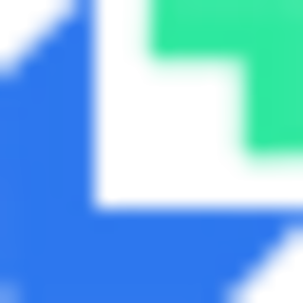

<p align="center">
  
</p>

<h1 align="center">SecKeyBox</h1>

<p align="center">
  A local-first password manager built for developers.
</p>

<p align="center">
  <a href="https://github.com/EthanCheung-gh/SecKeyBox/releases"></a>
  
  <a href="license"></a>
</p>

<p align="center">
  English · <a href="README.zh-CN.md">简体中文</a>
</p>

---

## Why SecKeyBox

Developer credentials do not fit the "website + password" model of classic password managers. SecKeyBox ships with eight purpose-built entry types — from database connections and SSH servers to cloud access keys, license keys and SMTP accounts — stores everything in a local encrypted SQLite database, and never talks to a server.

**The installer ships with zero built-in credentials.** First launch walks you through creating a vault with your own master password. No accounts, no cloud, no telemetry.

## Features

| Area | What you get |
|------|--------------|
| 8 credential types | Account, API Key, Environment Variables, Database Connection, SSH Server, Cloud Credential, License, SMTP Account |
| Purpose-built fields | e.g. Database: type/host/port/DB name/user/password/connection URL; SSH: host/port/user/password/key path/key passphrase |
| Encryption | Per-field AES-256-GCM with a random nonce; key derived from your master password with Argon2id (m=64 MB, t=3, p=4) |
| Master password change | Verifies the current password, derives a fresh key, and re-encrypts **every** stored secret in a single transaction — a failure rolls back and leaves the vault readable |
| Group management | Built-in group per credential type; every group (built-in included) can be renamed or deleted, with cascade delete of contained items |
| Search | Sidebar search filters title and subtitle across the item list in real time |
| Import / Export | JSON backup export; merge or replace import (data stays encrypted in backups) |
| Session safety | Auto-lock after 5 minutes of inactivity; clipboard auto-clear 30 s after copying a secret; keys are zeroized on drop |
| Appearance | Light / dark / follow-system theme |

Notes are stored as plain text by design (searchable); all password/key/secret fields are encrypted.

## Security model

```
Master password
   │  Argon2id (m=64MB, t=3, p=4)
   ▼
32-byte key ──► AES-256-GCM, unique nonce per field
   │
   ▼
Sensitive fields in a local SQLite database
```

- The master password never leaves your machine; only its PHC hash and salt are stored (for verification).
- Locking the vault drops the in-memory key; unlocking requires a fresh derivation.
- Changing the master password rotates the key for all data atomically (see [tests](src-tauri/src/db/operations.rs) covering rotation, NULL secrets and rollback).

## Download

Grab an installer from the [latest release](https://github.com/EthanCheung-gh/SecKeyBox/releases/latest):

| Platform | Artifact |
|----------|----------|
| Windows | `.msi` or `.exe` (NSIS setup) |
| macOS (Apple Silicon) | `.dmg` |
| Linux | `.deb`, `.rpm`, `.AppImage` |

## Build from source

Prerequisites: [Rust](https://rustup.rs) 1.70+, Node.js 18+, and the [Tauri v2 system dependencies](https://tauri.app/start/prerequisites/) for your platform (e.g. `libwebkit2gtk-4.1-dev libgtk-3-dev` on Debian/Ubuntu).

```bash
git clone https://github.com/EthanCheung-gh/SecKeyBox.git
cd SecKeyBox
npm install

npm run tauri dev     # run the desktop app in dev mode
npm run tauri build   # produce installers in src-tauri/target/release/bundle/
```

Useful scripts:

```bash
npm run dev           # frontend only in a plain browser (a built-in mock
                      # replaces the Tauri backend, seeded with demo data)
npm run build         # typecheck + production web build
cd src-tauri && cargo test   # unit tests incl. re-encryption & cascade tests
```

## Project structure

```
SecKeyBox/
├── src/                    # React frontend
│   ├── components/         # layout, modals, unlock screens, ui primitives
│   ├── stores/             # Zustand stores (vault / ui / settings)
│   ├── lib/                # Tauri API wrappers, utils
│   └── mocks/              # dev-only browser mock of the Tauri backend
├── src-tauri/              # Rust backend
│   └── src/
│       ├── commands/       # Tauri commands (vault / items / import-export)
│       ├── crypto/         # Argon2id KDF + AES-256-GCM cipher
│       ├── db/             # schema, migrations, data access
│       └── state.rs        # in-memory vault state (master key)
└── .github/workflows/      # tag-triggered release CI (3 platforms)
```

## Roadmap

- [ ] Browser extension
- [ ] Mobile apps
- [ ] End-to-end encrypted cloud sync
- [ ] Password generator
- [ ] Attachments and tags
- [ ] Autocomplete / autofill

## Contributing

Issues and pull requests are welcome. For larger changes, please open an issue first to discuss the design.

## License

[Apache License 2.0](license) © 2026 EthanCheung
